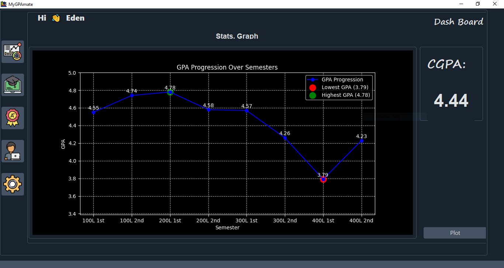
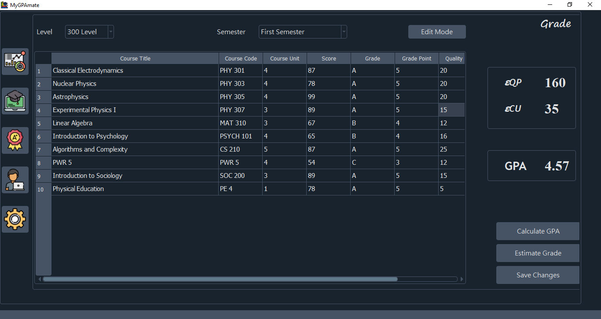

# MyGPAmate

MyGPAmate is a desktop application built with PyQt5 to help students track their GPA across academic sessions. The application allows users to visualize their GPA trends through a graph generated using Matplotlib. Additionally, MyGPAmate provides users with their Cumulative Grade Point Average (CGPA) for a comprehensive overview of their academic performance.


## Screenshots




## Features

- **GPA Tracking:** Easily record and update your grades for each course as the semester progresses.
- **Graphical Visualization:** Visualize your GPA trends over time with dynamic graphs generated using Matplotlib.
- **CGPA Calculation:** MyGPAmate calculates and displays the Cumulative Grade Point Average (CGPA) based on your entered grades.
- **User-Friendly Interface:** Intuitive design for a seamless user experience.

## Requirements

- Python 3.x
- PyQt5
- Matplotlib

## Installation

1. Clone the repository:

    ```bash
    git clone https://github.com/edeniyanda/MyGPAmate.git
    cd MyGPAmate
    ```

2. Install dependencies:

    ```bash
    pip install -r requirements.txt
    ```

3. Run the application:

    ```bash
    python main.py
    ```

## Usage

1. Launch the application.
2. Sign up on the application with Email
3. Go to the My Course Tab to add you Courses for the particular Semester
4. Switch to the Grade Tab to edit your grades for each Course
5. Save all Changes and Click on Estimate GPA, this will do the Job
6. Go back to My Dashboard tab to View the dynamic graph to analyze your GPA trends.
7. The CGPA will be automatically calculated and displayed.


## Contributing

Contributions are welcome! Please follow the [contribution guidelines](CONTRIBUTING.md).

## License

This project is licensed under the [MIT License](LICENSE).

## Acknowledgments

- Special thanks to [PyQt](https://riverbankcomputing.com/software/pyqt/) and [Matplotlib](https://matplotlib.org/) for their powerful libraries.

- Special thanks to [Flaticon.com](https://www.flaticon.com) for the visually appealing icons used in the application:

  - [Dashboard icons](https://www.flaticon.com/free-icons/dashboard) created by Eucalyp - Flaticon
  - [Settings icons](https://www.flaticon.com/free-icons/settings) created by Pixel perfect - Flaticon
  - [Course icons](https://www.flaticon.com/free-icons/course) created by Freepik - Flaticon
  - [User icons](https://www.flaticon.com/free-icons/user) created by Freepik - Flaticon
  - [Grades icons](https://www.flaticon.com/free-icons/grades) created by Freepik - Flaticon
  - [Scholarship icons](https://www.flaticon.com/free-icons/scholarship) created by srip - Flaticon

These contributions significantly enhance the visual appeal and functionality of the application.
